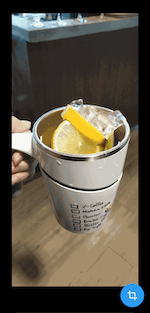

# Simple Image Cropper

[](https://pub.dev/packages/simple_image_cropper)

A Flutter plugin for cropping images.

## Image

Crop your image by selecting the region.



## Installation

To use this plugin, add `simple_image_cropper` as a dependency in the pubspec.yaml.

## Required parameters

- **image**: The image to be cropped.
- **width**: The width of this widget
- **height**: The height of this widget

## Customization

| Property | Description | Type |
| ----------------- |----------|:-----------:|
| `outerRectColor`  | Change the color of the outer rectangle. The default color is white color. | Color |
| `outerRectColor` | Change the color of the outer rectangle. The default color is white color. | Color |
| `innerRectColor` |  Change the color of the inner rectangle. The default color is red color. | Color |
| `outerRectStrokeWidth` |  Change the outer rectangle stroke width. The default value is 1.0. | double |
| `innerRectStrokeWidth` |  Change the inner rectangle stroke width. The default value is 3.0. | double |
| `tlConerBgColor` |  Change the cancel button background color. The default color is white color. | Color |
| `tlCornerFontColor` |  Change the cancel button font color. The default color is grey color. | Color |
| `brCornerBgColor` |  Change the resize button background color. The default color is blue color. | Color |
| `brCornerFontColor` |  Change the resize button font color. The default color is white color | Color |

## Example

```dart
import 'package:flutter/material.dart';
import 'package:simple_image_cropper/simple_image_cropper.dart';

void main() {
  runApp(MyApp());
}

class MyApp extends StatelessWidget {
  @override
  Widget build(BuildContext context) {
    return MaterialApp(
      title: 'Image Cropper Demo',
      theme: ThemeData(
        primarySwatch: Colors.blue,
      ),
      home: Demo(),
    );
  }
}

class Demo extends StatefulWidget {
  Demo({Key? key}) : super(key: key);

  @override
  _DemoState createState() => _DemoState();
}

class _DemoState extends State<Demo> {
  late ImageProvider _image;
  final GlobalKey<SimpleImageCropperState> cropKey = GlobalKey();

  @override
  void initState() {
    _image = AssetImage('assets/images/demo.jpg');
    super.initState();
  }

  @override
  Widget build(BuildContext context) {
    final Size size = MediaQuery.of(context).size;
    return Scaffold(
        floatingActionButton: FloatingActionButton(
          child: Icon(Icons.crop),
          onPressed: () async {
            Image? image = await cropKey.currentState?.cropImage();
            if (image != null) {
              setState(() => _image = image.image);
            }
          },
        ),
        body: Container(
            height: size.height,
            width: size.width,
            child: SimpleImageCropper(
              key: cropKey,
              height: size.height,
              width: size.width,
              image: _image,
            )));
  }
}
```
